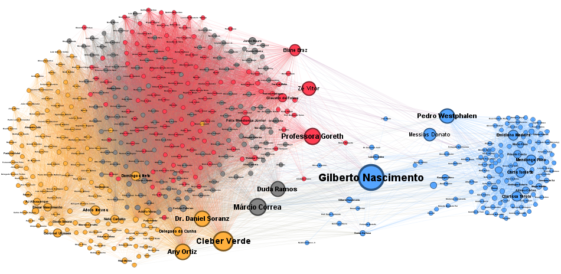

# Análise de Redes Sociais (ARS) para Mapeamento de Stakeholders: Padrões de Votação para o Arcabouço Fiscal

## Sobre o Projeto
Na intersecção entre a Macroeconomia e a Análise Política, mensurar o risco legislativo de uma pauta complexa exige precisão. Para avaliar a previsibilidade institucional, não basta mapear todos os 513 deputados, é necessário identificar quem são os verdadeiros influenciadores, qual o **custo de transação** das negociações e como os blocos de interesse se comportam na prática, para além de suas legendas partidárias.

Este projeto utiliza **Análise de Redes Sociais Computacional** para mapear as redes de influência na Câmara dos Deputados. Como estudo de caso, modelou-se as votações do **Novo Arcabouço Fiscal (PLP 93/2023)**, demonstrando como a matemática pode desmascarar alianças informais, revelar a divisão pragmática do Centrão e identificar os *stakeholders* críticos com poder de travar ou acelerar a principal âncora econômica do país.

## Metodologia e Modelagem
O pipeline dos dados foi construído com foco em reprodutibilidade:
1. **Extração:** Raspagem automatizada via API Aberta da Câmara dos Deputados.
2. **Modelagem Algébrica:** Em vez da simples contagem de votos, aplicou-se o **Índice de Similaridade de Jaccard** para construir a matriz de adjacência, permitindo que o grafo reflita a coesão tática exata entre os parlamentares. Tratamento de abstenções institucionais e ausências, além da aplicação de um *threshold* restrito (0.80+) para eliminar ruídos procedimentais.
3. **Inteligência Analítica (Métricas de Rede):**
   * **Algoritmo Não-Supervisionado:** Uso do Algoritmo de Louvain para detecção de comunidades (bancadas informais).
   * **Betweenness Centrality (Intermediação):** Cálculo para elencar os parlamentares-chave que atuam como pontes.
4. **Visualização:** Renderização topológica via Gephi (*ForceAtlas 2*).

---

## Data Storytelling: Decifrando o Arcabouço Fiscal

A topologia gerada pelo algoritmo é alheia a dimensão ideológica, portanto, ela agrupa parlamentares estritamente pelo comportamento. Isso nos permitiu extrair três *insights* fundamentais:

### 1. Oposição Comportamental
O **Bloco 1 (Azul)** revelou um fenômeno interessante: a união tática de extremidades. O algoritmo agrupou a direita (**PL**, 60,2% do bloco) e a esquerda (**PSOL**, 10,2%) na mesma comunidade. Embora em diferentes pontas ideológicas, ambos votaram para rejeitar a pauta em questão (o PL por oposição sistemática, o PSOL por rejeição ao teto de gastos).

### 2. Base Governista
O **Bloco 3 (Vermelho)** representa a coalizão governista orgânica. Formado majoritariamente por **PT, PDT e PSB**, é o núcleo duro de apoio operando em alta densidade e sincronia em defesa do projeto original do Ministério da Fazenda.

### 3. Fisiologia do Centrão
O grafo demonstra matematicamente que o "Centrão" (partidos fisiológicos, discutidos amplamente na literatura de comportamento partidário brasileiro) não operou como um bloco monolítico durante as rodadas de votação do Arcabouço. Eles se dividiram em duas grandes massas de negociação para aprovar emendas específicas:
*   **Bloco 4 (Laranja):** A força motriz liderada pela base de Arthur Lira (**UNIÃO Brasil e PP**).
*   **Bloco 2 (Verde):** Uma segunda ala pragmática forte, ancorada no **MDB, Republicanos e PSD**.

---

## Resultados Analíticos do Mapeamento
A métrica de *Betweenness Centrality* (Grau de Articulação) nos auxilia ao indicar os deputados que transitam entre blocos rivais e detêm o poder de travar ou acelerar negociações na rede.

**Top 10 Articuladores (Pontes entre Blocos):**

|Deputado            |Partido      |UF | Grau de Articulação| Bloco Informal|
|:-------------------|:------------|:--|-------------------:|--------------:|
|Gilberto Nascimento |PSD          |SP |              0.0544|              1|
|Cleber Verde        |MDB          |MA |              0.0392|              4|
|Márcio Correa       |MDB          |GO |              0.0325|              2|
|Professora Goreth   |PDT          |AP |              0.0304|              3|
|Dr. Daniel Soranz   |PSD          |RJ |              0.0292|              4|
|Any Ortiz           |CIDADANIA    |RS |              0.0292|              4|
|Pedro Westphalen    |PP           |RS |              0.0270|              1|
|Duda Ramos          |MDB          |RR |              0.0265|              2|
|Zé Vitor            |PL           |MG |              0.0249|              3|
|Messias Donato      |REPUBLICANOS |ES |              0.0215|              1|

**Tamanho das Bancadas (Comunidades):**

| Bloco Informal| Total de Deputados|
|--------------:|------------------:|
|              4|                138|
|              2|                132|
|              3|                132|
|              1|                128|

**Composição Partidária dos Blocos:**

| Bloco Informal|Partido      | Qtd Deputados| Peso no Bloco (%)|
|--------------:|:------------|-------------:|-----------------:|
|              1|PL           |            77|              60.2|
|              1|PSOL         |            13|              10.2|
|              1|UNIÃO        |            10|               7.8|
|              1|PP           |             6|               4.7|
|              2|MDB          |            36|              27.3|
|              2|REPUBLICANOS |            36|              27.3|
|              2|PSD          |            24|              18.2|
|              2|PODE         |             9|               6.8|
|              3|PT           |            59|              44.7|
|              3|PDT          |            17|              12.9|
|              3|PSB          |            14|              10.6|
|              3|PSD          |            12|               9.1|
|              4|UNIÃO        |            46|              33.3|
|              4|PP           |            36|              26.1|
|              4|PL           |            17|              12.3|
|              4|PSD          |             8|               5.8|

---

## Autor
**Francisco Blasco**  
*Graduando em Relações Econômicas Internacionais e Pesquisador no Centro de Estudos Legislativos (CEL-DCP/UFMG).*
